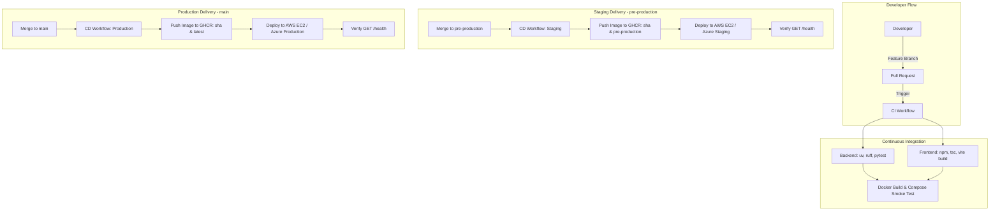

# Meridian Resorts & Spa — CI/CD Pipeline Documentation

This document describes the complete Continuous Integration (CI) and Continuous Delivery/Deployment (CD) architecture for the **Meridian Resorts & Spa** operations platform.

---

## 1. CI/CD Architecture Overview

The pipeline automates testing, code quality checks, container builds, container registry publishing, and multi-cloud deployment using **GitHub Actions**, **GitHub Container Registry (GHCR)**, **AWS**, and **Azure**.



---

## 2. Branching Strategy

The repository follows an enterprise trunk-based flow with dedicated staging & production branches:

| Branch Name | Purpose | Triggered Actions | Deployment Target |
| :--- | :--- | :--- | :--- |
| `feature/*` / `topic/*` | Daily feature development & bug fixes | **CI Only** (lint, tests, Docker build) | None |
| `pre-production` | Integration testing & pre-release staging | **CI + CD (Staging)** | Staging Environment |
| `main` | Production releases | **CI + CD (Production)** | Production Environment |

- **Pull Requests**: Pull Requests targeting `pre-production` or `main` run full CI validation. Merging is blocked if tests or linting fail.
- **Protected Main**: Direct commits to `main` should be restricted. All changes land via reviewed Pull Requests.

---

## 3. Workflows Breakdown

### A. Continuous Integration (`.github/workflows/ci.yml`)
Runs on every branch push and every pull request targeting `main` or `pre-production`.
- **Backend Job**:
  - Uses `astral-sh/setup-uv@v5` with caching of `uv.lock`.
  - Installs dependencies via `uv sync --frozen --group dev`.
  - Runs linting: `uv run ruff check app tests`.
  - Runs unit/integration tests: `uv run pytest -v`.
- **Frontend Job**:
  - Uses `actions/setup-node@v4` (Node.js 20) with npm cache.
  - Installs dependencies: `npm ci --legacy-peer-deps`.
  - Runs type checking: `npm run lint` (`tsc --noEmit`).
  - Runs production bundle build: `npm run build`.
- **Docker Validation Job**:
  - Uses Docker Buildx with GitHub Actions layer cache (`type=gha`).
  - Builds `meridian-backend` and `meridian-frontend` images without pushing.
  - Boots up container stack via `docker compose up -d` and verifies that the `GET /health` endpoint returns `200 OK`.
  - Tears down test containers.

### B. Continuous Delivery & Deployment (`.github/workflows/cd.yml`)
Triggered only on pushes to `pre-production`, `main`, or manual trigger via `workflow_dispatch`.
- **Build & Push Job**:
  - Logs in to `ghcr.io` using ephemeral `GITHUB_TOKEN`.
  - Tags images with immutable commit SHA (`${{ github.sha }}` / short SHA) and branch tags (`pre-production` or `latest`).
  - Pushes images to GHCR:
    - `ghcr.io/<repo-owner>/meridian-backend:<sha>`
    - `ghcr.io/<repo-owner>/meridian-frontend:<sha>`
- **Deploy Staging Job**:
  - Executes only on `pre-production` branch.
  - Pulls pre-built GHCR images on Staging server.
  - Starts services using `docker-compose.prod.yml`.
  - Runs automated health check against `GET /health`.
- **Deploy Production Job**:
  - Executes only on `main` branch.
  - Deploys immutable versioned images to Production host.
  - Runs automated health check against `GET /health`.

---

## 4. GitHub Container Registry (GHCR) Configuration

Docker images are automatically published to GitHub Packages / Container Registry under the repository namespace.

Image URLs:
```
ghcr.io/<github-owner>/meridian-backend:<short-sha>
ghcr.io/<github-owner>/meridian-frontend:<short-sha>
```

Authentication is handled securely via GitHub Actions' built-in `GITHUB_TOKEN` with `packages: write` permissions.

---

## 5. Deployment Target Configuration

### A. AWS Deployment (EC2 with Docker Compose)

1. Launch an EC2 instance running Ubuntu 24.04 LTS.
2. Install Docker and Docker Compose plugin.
3. Add the EC2 server SSH private key and connection details to GitHub Secrets.
4. The CD workflow connects via SSH, copies `docker-compose.prod.yml`, pulls the newly built GHCR images, and restarts the containers seamlessly.

### B. Azure Deployment (Azure App Service for Containers)

1. Create an Azure App Service (Linux / Docker Container).
2. Download the **Publish Profile** XML from the Azure Portal.
3. Save the publish profile as a secret in GitHub (`AZURE_PROD_PUBLISH_PROFILE`).
4. The CD workflow triggers `azure/webapps-deploy@v3` with the GHCR image tag.

---

## 6. GitHub Secrets & Environments Reference

### Repository Secrets (`Settings -> Secrets and variables -> Actions`)

| Secret Name | Required For | Description |
| :--- | :--- | :--- |
| `POSTGRES_PASSWORD` | App Runtime | PostgreSQL database password |
| `DATABASE_URL` | App Runtime | Full connection string to PostgreSQL |
| `MONGO_URL` | App Runtime | MongoDB connection string |
| `OPENAI_API_KEY` | App Runtime | OpenAI API key for Concierge Chatbot |
| `AUTH_SECRET` | App Runtime | Secret key for JWT auth token signing |

### Environment-Specific Secrets

#### Environment: `staging`
| Secret / Variable | Description |
| :--- | :--- |
| `STAGING_EC2_HOST` | Public IP or DNS of the Staging EC2 instance |
| `STAGING_EC2_USER` | SSH username (default: `ubuntu`) |
| `STAGING_EC2_SSH_KEY` | Private SSH Key (`.pem`) for Staging EC2 access |
| `STAGING_HEALTH_URL` *(Variable)* | Staging health check URL (e.g. `http://staging.yourdomain.com:8000/health`) |
| `AZURE_STAGING_APP_NAME` | Azure App Service name for staging |
| `AZURE_STAGING_PUBLISH_PROFILE`| Azure Publish Profile XML for staging |

#### Environment: `production`
| Secret / Variable | Description |
| :--- | :--- |
| `PROD_EC2_HOST` | Public IP or DNS of the Production EC2 instance |
| `PROD_EC2_USER` | SSH username (default: `ubuntu`) |
| `PROD_EC2_SSH_KEY` | Private SSH Key (`.pem`) for Production EC2 access |
| `PROD_HEALTH_URL` *(Variable)* | Production health check URL (e.g. `https://api.yourdomain.com/health`) |
| `AZURE_PROD_APP_NAME` | Azure App Service name for production |
| `AZURE_PROD_PUBLISH_PROFILE` | Azure Publish Profile XML for production |

---

## 7. How to Operate the Pipeline

### How to Trigger CI
- Create a feature branch: `git checkout -b feature/new-service`
- Push commits: `git push origin feature/new-service`
- Open a Pull Request targeting `pre-production` or `main`. CI runs automatically.

### How to Trigger Staging Deployment
- Merge an approved PR into `pre-production`, OR
- Manually run `.github/workflows/cd.yml` via the GitHub Actions **Run workflow** button with environment `staging`.

### How to Trigger Production Deployment
- Merge an approved PR into `main`, OR
- Manually run `.github/workflows/cd.yml` via the GitHub Actions **Run workflow** button with environment `production`.

---

## 8. Health Checks & Rollback Procedures

### Health Check Endpoint
The backend includes a dedicated health endpoint at:
```http
GET /health
```
Response:
```json
{
  "status": "ok"
}
```

The CD workflow polls this endpoint up to 12 times with 5-second intervals after deploying. If the endpoint does not return `200 OK`, the workflow immediately fails.

### Rollback Procedure
Because every deployment uses immutable short-SHA image tags, rolling back is instant and deterministic:

1. **Option 1: Deploy a previous commit via workflow dispatch**
   - Go to GitHub Actions → Select **Continuous Delivery & Deployment (CD)**.
   - Click **Run workflow** → Select the previous stable commit SHA.
2. **Option 2: EC2 Instant Rollback**
   - SSH into the server:
     ```bash
     ssh ubuntu@<EC2_HOST>
     cd ~/app
     export BACKEND_IMAGE="ghcr.io/<owner>/meridian-backend:<PREVIOUS_SHA>"
     export FRONTEND_IMAGE="ghcr.io/<owner>/meridian-frontend:<PREVIOUS_SHA>"
     docker compose -f docker-compose.prod.yml up -d
     ```

---

## 9. Troubleshooting Common Pipeline Failures

1. **`uv sync` or dependency resolution error**:
   - Ensure `backend/uv.lock` is updated locally when dependencies in `backend/pyproject.toml` change:
     ```bash
     cd backend && uv lock
     ```
2. **Frontend TypeScript/Vite build failure**:
   - Run `npm run lint` and `npm run build` locally in `frontend/` to diagnose type issues or missing imports before pushing.
3. **GHCR Permission Denied (`403 Forbidden`)**:
   - Ensure the repository settings allow Actions to write packages:
     `Repository Settings -> Actions -> General -> Workflow permissions -> Read and write permissions`.
4. **Health Check Timeout during Deployment**:
   - Check container logs on host: `docker compose -f docker-compose.prod.yml logs -n 100 backend`.
   - Ensure database connection string (`DATABASE_URL`, `MONGO_URL`) is valid and firewall/security groups allow database traffic.
